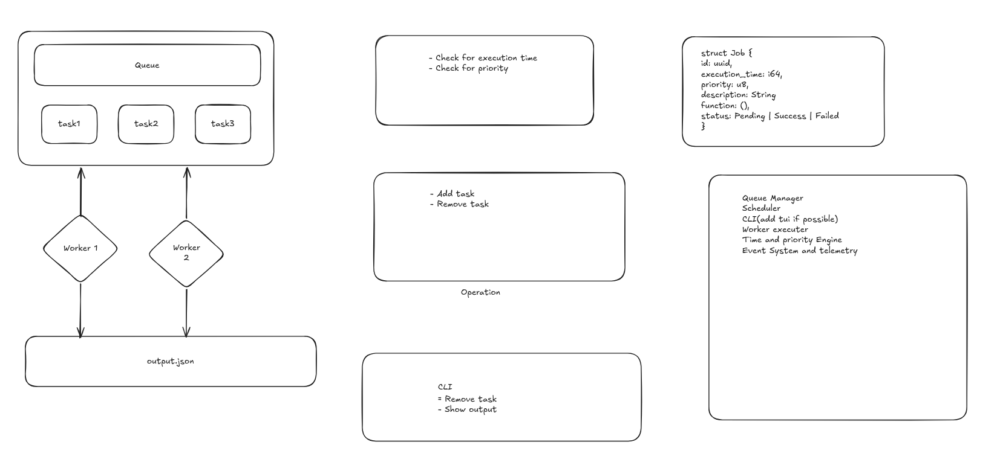

## Task Scheduler (Rust TUI)

**Task Scheduler** is a small, time‑ and priority‑based job scheduler written in Rust with a terminal UI built on `ratatui` and `crossterm`.  
It lets you queue jobs for future execution, pick which function to run, and watch execution logs in real time.

---

### Features

- **Time‑based scheduling**: Jobs become eligible to run at a specific Unix timestamp or after an offset in seconds.
- **Priority queue**: Higher‑priority jobs run first when multiple jobs are due.
- **Terminal UI (TUI)**:
  - View all pending jobs.
  - Add new jobs interactively.
  - Remove selected jobs.
  - View a live engine/worker log panel.
- **Pluggable workers**:
  - Jobs reference a `function` by name (e.g. `backup_fn`, `email_fn`, `hotfix_fn`).
  - Functions are registered in `worker.rs` and executed when the job fires.
- **Persistence**:
  - All queued jobs are snapshotted to `queue.json`.
  - On startup, jobs are restored from this file.
- **Telemetry & logging**:
  - Structured logging via `tracing`, with output to stdout and to rolling log files in `logs/`.
  - Periodic resource usage logging using `sysinfo`.

---


### Tech Stack

- **Language**: Rust (edition 2024)
- **Core crates**:
  - `chrono` – time handling.
  - `uuid` – unique job IDs.
  - `serde`, `serde_json` – job serialization.
  - `ratatui`, `crossterm` – terminal UI.
  - `tracing`, `tracing-subscriber`, `tracing-appender` – logging/telemetry.
  - `sysinfo` – CPU/memory telemetry.

See `Cargo.toml` for the full dependency list.

---

### Getting Started

#### Prerequisites

- Rust toolchain (recommended: `rustup` with current stable).

#### Build & Run

From the project root:

```bash
cargo build
cargo run
```

On first run:

- If `queue.json` does **not** exist or is empty:
  - The scheduler seeds the queue with three demo jobs:
    - `Backup Database` → `backup_fn`
    - `Send Emails` → `email_fn`
    - `Urgent Hotfix` → `hotfix_fn`
- A `logs/` directory will be created for telemetry if it does not already exist (by the `tracing-appender` rolling file logger).

---

### Terminal UI Usage

When you run `cargo run`, the TUI opens in the terminal.

- **Pending tasks panel (left)**:
  - Shows time, priority, and description of scheduled jobs.
  - Time is displayed as local timestamps based on each job’s `execution_time` (Unix seconds).
- **Engine / Worker log panel (right)**:
  - Streams messages from the Time & Priority Engine and Worker:
  - Examples:
    - `[Engine] Started.`
    - `[Engine] Dispatched 'Backup Database' (priority 5)`
    - `[Worker] Executing 'Backup Database'`
    - `[Worker] Done 'Backup Database'`

#### Keybindings (Normal Mode)

- **`↑` / `↓`**: Move selection through the job list.
- **`Ctrl+A`**: Open the **Add task** form.
- **`D`** or **Delete**: Remove the currently selected job.
- **`Q`** or **Esc** or **Ctrl+C**: Quit the TUI (and stop the engine).

#### Add Task Form

When you press `Ctrl+A`, an interactive form appears at the bottom:

- Fields are edited in sequence: **Time → Priority → Description → Function**.
- **Enter**: Move to the next field (or submit on the last field).
- **Esc**: Cancel adding a task and return to Normal mode.

Field details:

- **Time**
  - Accepts:
    - An offset in seconds from now (e.g. `5`, `+10`).
    - A Unix timestamp in seconds (e.g. `1730000000`).
  - Short values (less than `1_000_000_000`) are treated as relative seconds from the current time.
- **Priority**
  - `0–255` (`u8`).
  - Higher priority jobs are preferred when multiple jobs are ready at the same time.
- **Description**
  - Free‑form string to describe the job.
- **Function**
  - Name of the function to execute, matching the registry in `worker.rs`.
  - If there are predefined functions (e.g. `backup_fn`, `email_fn`, `hotfix_fn`), you can:
    - Use **`↑` / `↓`** to cycle through them.
    - Press **Enter** to confirm and submit.

If any field is invalid or empty, you’ll see a short error message in a popup.

---

### How It Works (Architecture)



- **`job.rs`**
  - Defines `Job` and its `Status` (`Pending`, `Running`, `Success`, `Failed`).
  - Each job has:
    - `id` (UUID),
    - `execution_time` (Unix seconds),
    - `priority`,
    - `description`,
    - `function` (string key),
    - retry configuration (`max_retries`, `retry_count`).
  - Provides helpers for status transitions and retry logic.

- **`queue.rs` – `QueueManager`**
  - Wraps a `BinaryHeap<Job>` for priority scheduling.
  - Ordering:
    - Earlier `execution_time` first.
    - For same time, higher `priority` first.
  - Key operations:
    - `push`, `pop`, `pop_ready(now)`, `remove(id)`, `snapshot()`.
  - Sends snapshots of the current job list to persistence whenever the queue changes.

- **`persistence_manager.rs` – `PersistenceManager`**
  - Manages saving/loading jobs to/from disk (`queue.json`).
  - `start_memory_snapshot()` spawns a background thread that:
    - Listens on a channel for job snapshots from `QueueManager`.
    - Serializes them to pretty JSON.
    - Writes atomically (`.tmp` file then `rename`) to avoid partial writes.
  - `load_jobs()`:
    - Reads `queue.json` if it exists and parses it into `Vec<Job>`.

- **`engine.rs` – `TimePriorityEngine`**
  - Background thread that:
    - Periodically (every 500ms) checks the queue for ready jobs (`pop_ready`).
    - Marks them as `Running` and sends them to the worker over a channel.
    - Optionally emits log lines over a `log_tx` channel for display in the TUI.
  - `start()` and `stop()` control the engine thread via an `AtomicBool` flag.

- **`worker.rs` – Worker & Registered Tasks**
  - Maintains a registry: `HashMap<String, Box<dyn Fn(Sender<String>) + Send>>`.
  - `register(name, f)`: register a function implementation under a string key.
  - `run_job`:
    - Looks up `job.function`.
    - Sends log messages, calls the registered function, updates job status.
    - If no function is registered, logs an error and triggers retry logic.
  - Example built‑in task functions:
    - `send_email`
    - `backup_db`
    - (Plus any inline closures you register from `main.rs`, such as `hotfix_fn`).

- **`tui.rs` – Terminal UI**
  - Ratatui‑based interface that:
    - Renders:
      - Pending tasks list.
      - Engine/worker logs.
      - Contextual help / add‑task form or status bar.
    - Responds to keyboard input and manipulates the shared `QueueManager` (via `Arc<Mutex<_>>`).

- **`telemetry.rs` – Logging & Resource Usage**
  - Configures a `tracing` subscriber with:
    - A terminal (stdout) logger.
    - A daily rolling file logger: `logs/scheduler.log.YYYY-MM-DD`.
  - Provides `log_resource_usage()` which logs basic CPU and memory stats using `sysinfo`.

- **`main.rs` – Wiring It All Together**
  - Initializes telemetry.
  - Loads jobs from `queue.json` via `PersistenceManager`.
  - Constructs a `QueueManager` and attaches persistence snapshot channel.
  - Starts the `TimePriorityEngine` in a background thread.
  - Spawns a worker thread:
    - Registers `backup_fn`, `email_fn`, and a `hotfix_fn` closure, all tied to functions in `worker.rs`.
  - Launches the TUI with:
    - Shared queue,
    - Log receiver,
    - Worker sender,
    - List of available function names for the Add Task form.

---

### Adding New Task Types

To introduce new job types (new functions to execute):

1. **Implement the function** in `worker.rs`:

   ```rust
   pub fn my_custom_task(log_tx: Sender<String>) {
       let _ = log_tx.send("[Task] Running my_custom_task".to_string());
       // Your logic here
   }
   ```

2. **Register it** in `main.rs` when constructing the worker:

   ```rust
   worker.register("my_custom_fn", scheduler::worker::my_custom_task);
   ```

3. **Expose it in the TUI**:
   - Add `"my_custom_fn".into()` to the `available_functions` vector passed into `tui::run_tui`.
   - After that, you can select `my_custom_fn` via the Function field (with `↑` / `↓`) when adding a task.

4. **Schedule it**:
   - In the TUI Add Task form, select or type `my_custom_fn` in the Function field.

---

### Persistence & Files

- **`queue.json`**
  - Human‑readable JSON list of `Job` objects.
  - Updated automatically whenever the queue changes (add, pop, remove, status update).
  - Safe to delete if you want to reset the queue; the scheduler will just treat it as empty on next startup.

- **`logs/`**
  - Contains daily log files:
    - `scheduler.log.YYYY-MM-DD`
  - Logs include:
    - Telemetry startup messages.
    - Resource usage summaries.
    - Any `tracing` events sent by code.

---

### Running Tests

The project includes unit tests for jobs, queue behavior, engine, worker, and persistence:

```bash
cargo test
```

---

### Limitations & Notes

- This is a single‑process, in‑memory scheduler:
  - Jobs run in the same process that hosts the engine and TUI (worker runs on its own thread, but still within the same binary).
- There is currently no authentication, multi‑user logic, or networking; it’s a local scheduler.
- Job functions are pure Rust code; executing external commands or integrating with real systems (email, databases, etc.) must be implemented inside those functions.

---

### License

If you plan to publish this project, add your license details here (e.g. MIT, Apache‑2.0).

